# Elysian Escapes

Elysian Escapes is a luxury travel website that allows users to explore bespoke itineraries, exclusive experiences, and premium travel services. The site offers an elegant, intuitive interface for discovering high-end travel options and contacting the company for personalized assistance.

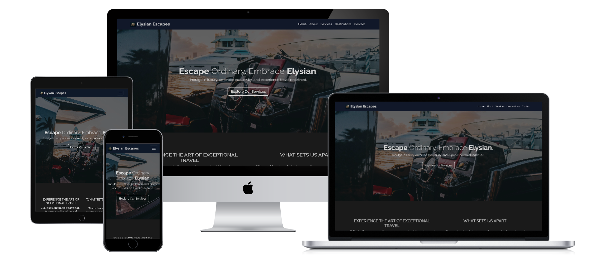

### **Live Website**
[Elysian Escapes](https://johnxt10.github.io/elysian-escapes/)

## Table of Contents

- [Purpose & User Value](#purpose--user-value)
- [Deployment Procedure](#deployment-procedure)
- [Screenshots](#screenshots)
  - [Home Page](#home-page)
  - [Services Page](#services-page)
  - [Destinations Section](#destinations-section)
  - [Contact Page](#contact-page)
- [Wireframes](#wireframes)
- [Attribution](#attribution)
- [Reflections on AI Use](#reflections-on-ai-use)
  - [Key Decisions & Outcomes](#key-decisions--outcomes)
  - [Bug Identification & Resolution](#bug-identification--resolution)
  - [Performance & UX Improvements](#performance--ux-improvements)
  - [Workflow & Efficiency](#workflow--efficiency)
- [Testing](#testing)
  - [HTML Testing](#html-testing)
  - [CSS Testing](#css-testing)
  - [Home](#home)
  - [About](#about)
  - [Services](#services)
  - [Contact](#contact)
  - [Diagnostics](#diagnostics)
- [Updates](#updates)
  - [General](#general)
  - [README.md](#readmemd)

---

## Purpose & User Value

- **Purpose:** To present luxury travel services and destinations in a visually appealing, easy-to-navigate format, making it simple for users to inquire about and book premium experiences.
- **User Value:** Users can quickly browse services, view featured destinations, and contact the company — all in a seamless, mobile-friendly experience.

## Deployment Procedure

1. **Clone or download** this repository.
2. Open `index.html` in your web browser to view the site locally.
3. To deploy online, upload all files to your preferred static web host (e.g., GitHub Pages, Netlify, Vercel).

## Screenshots

### Home Page
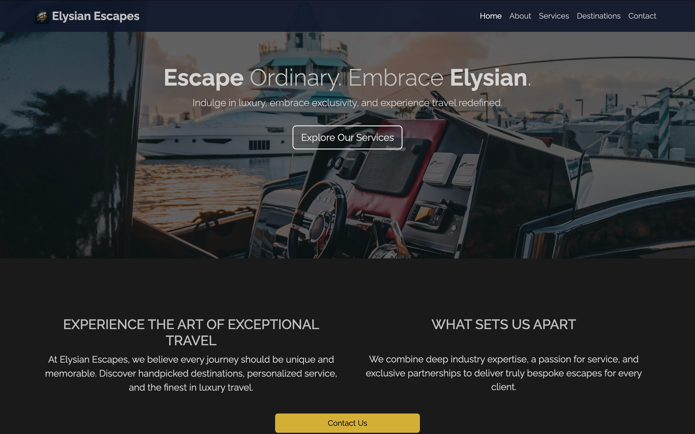  
*Features a welcoming hero section, navigation bar, and introduction to the company. Users immediately see the brand’s luxury appeal.*

### Services Page
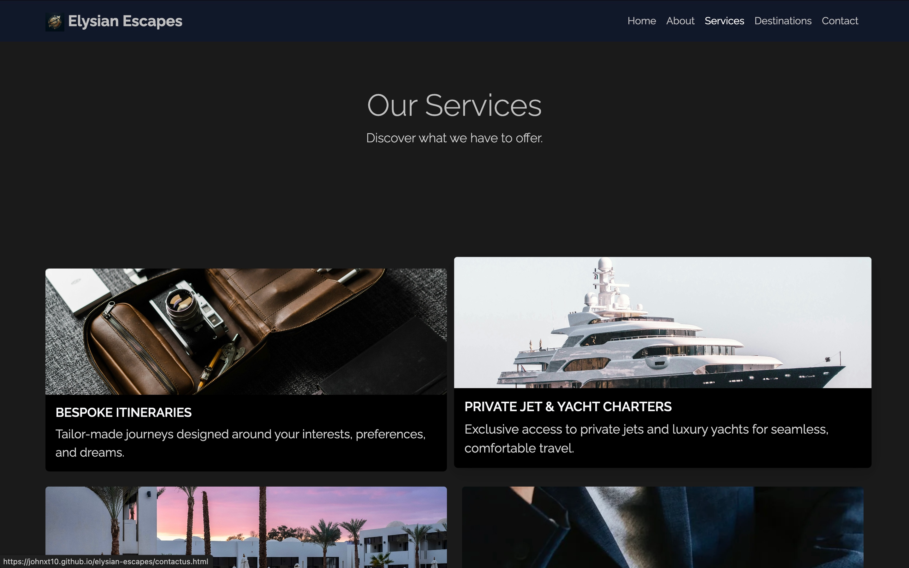  
*Displays clickable service cards. Users can easily explore offerings and reach out for bespoke travel planning.*

### Destinations Section
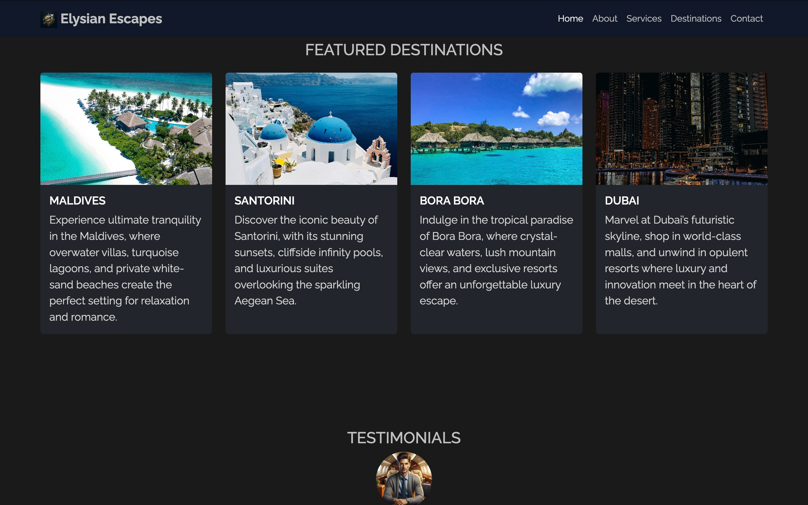  
*Highlights featured destinations within the homepager with images and descriptions, inspiring users to discover new places.*

### Contact Page
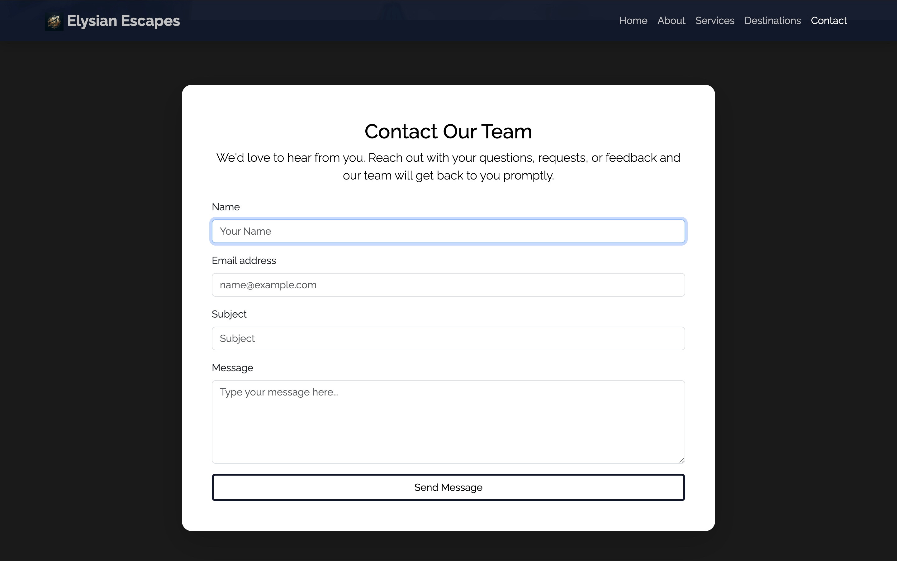  
*Simple contact form for users to request more information or personalized service.*

## Wireframes

Below are the original wireframes used to plan the layout and user experience for Elysian Escapes.

### Multiview Wireframe – Homepage on all devices

### **Individual Wireframes**
[Mobile Wireframe](assets/screenshots/wireframes/mobile.png "Mobile wireframe")

[Tablet Wireframe](assets/screenshots/wireframes/tablet.png "Tablet wireframe")

[Desktop Wireframe](assets/screenshots/wireframes/desktop.png "Desktop wireframe")

## Attribution

- All code is original unless otherwise noted.
- Bootstrap 5 is used for layout and styling: [https://getbootstrap.com/](https://getbootstrap.com/)
- Images are sourced from Unsplash and Pexels, and converted to WebP for smaller file size to increase the sites perfermoance (see `/assets/images/` for details) .
- Any additional code or assets from external sources are clearly commented in the codebase.

---

## Reflections on AI Use

### Key Decisions & Outcomes
AI was used to generate HTML/CSS structures, suggest Bootstrap utility classes, and recommend layout improvements. This led to a more consistent and visually appealing design, with efficient implementation of responsive features and interactive elements.

### Bug Identification & Resolution
AI played a role in quickly identifying and resolving layout and styling bugs, such as card alignment and button positioning. Suggestions for Bootstrap class usage and CSS adjustments resulted in faster debugging and a smoother user experience.

### Performance & UX Improvements
AI contributed to performance and UX by recommending best practices for responsive design, semantic HTML, and accessibility. This ensured the site loads efficiently and provides a seamless experience across devices.

### Workflow & Efficiency
AI support streamlined the workflow by providing instant code suggestions, troubleshooting, and design ideas. This improved development speed and allowed for rapid iteration, resulting in a polished final product with minimal manual trial-and-error.

## Testing

### HTML Testing
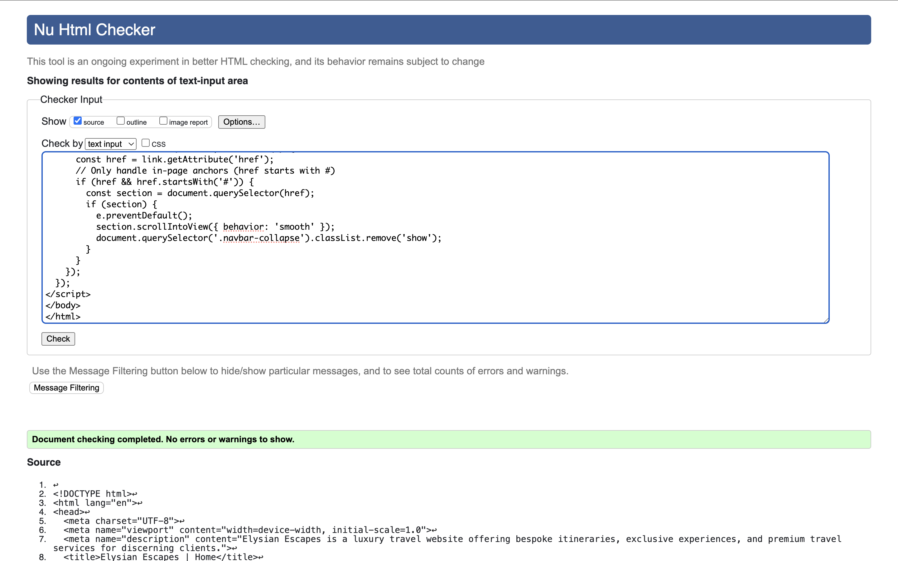  
*The HTML testing report confirms that there were no errors or warnings detected across all pages of the website. This ensures that the markup is valid, standards-compliant, and contributes to reliable rendering and accessibility on all modern browsers.*

### CSS Testing

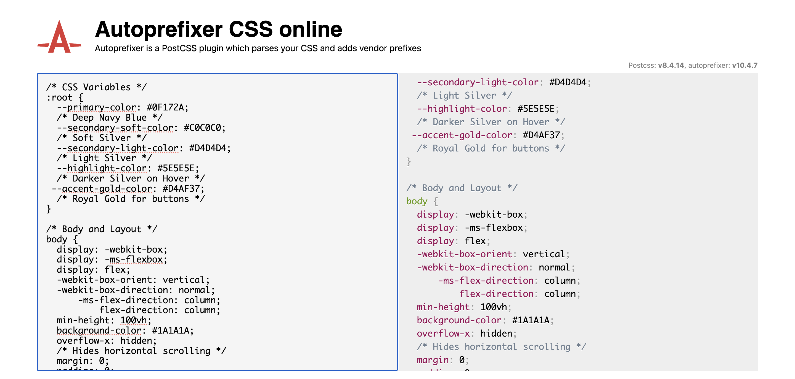  
*The CSS Autoprefixer tool was used to automatically add vendor prefixes to the CSS code. This ensures that the latest CSS features are compatible and function correctly across all major browsers, providing a consistent user experience.*

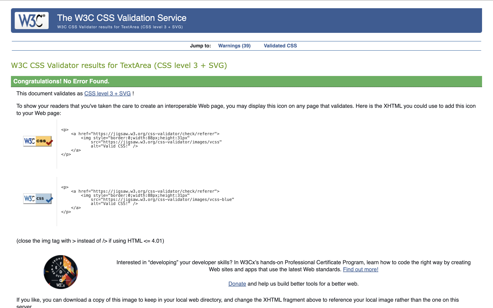  
*After processing the styles with Autoprefixer, the CSS was tested using a validation tool. No errors were found, confirming that the code is standards-compliant and robust across different environments.*

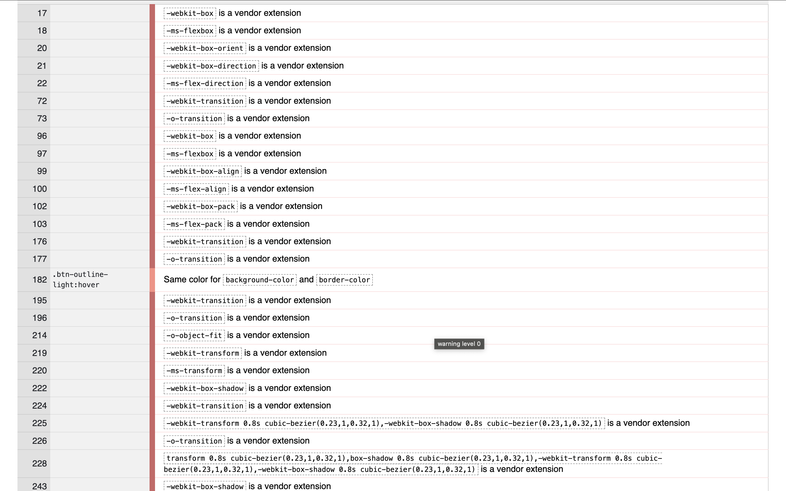  
*Some warnings were reported during CSS validation. Many of these, such as those generated by Autoprefixer, can be safely ignored as they are necessary for cross-browser compatibility. Other warnings, like "background-color and border-color are the same," are intentional design choices to maintain the luxury aesthetic of the website and can also be disregarded.*

### Home
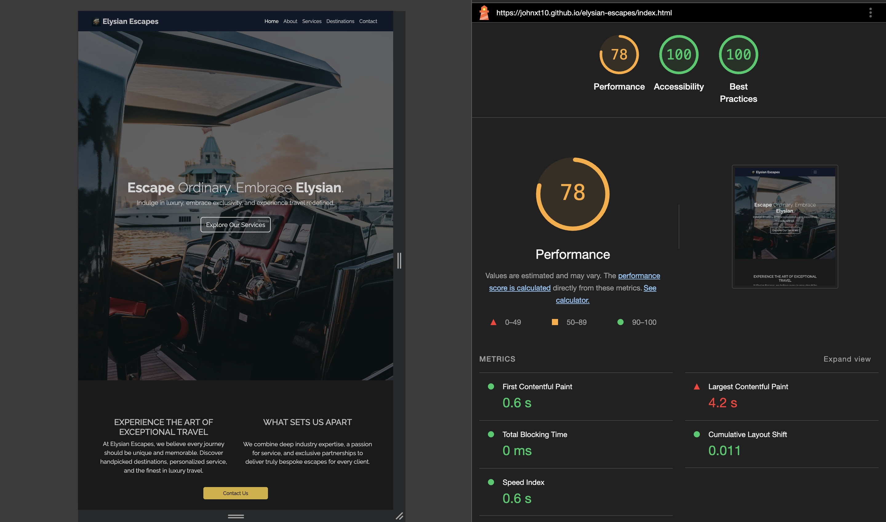  
*The Home page Lighthouse report demonstrates strong performance, accessibility, and adherence to best practices.

Performance: The page loads quickly, with optimized images and efficient resource loading, ensuring a smooth user experience.
Accessibility: Semantic HTML, proper heading structure, and descriptive alt text make the page usable for all visitors, including those using assistive technologies.
Best Practices: Secure HTTPS, responsive design, and clean code contribute to a reliable and professional site.*

### About
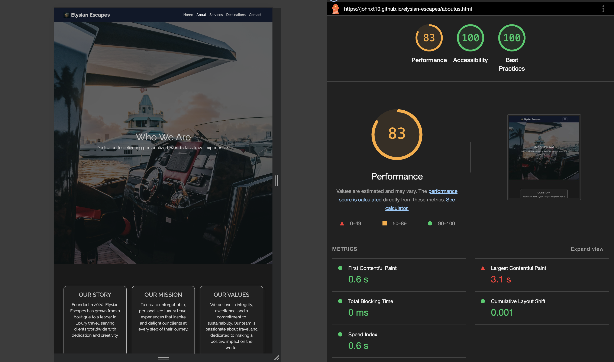  
*The About page Lighthouse report confirms that team member profiles and images are displayed efficiently and accessibly.

Performance: Images are compressed and sized appropriately, reducing load times.
Accessibility: Team member names and roles use semantic tags, and all images have meaningful alt text.
Best Practices: The page follows modern web standards, with mobile-friendly layouts and no critical errors.*

### Services
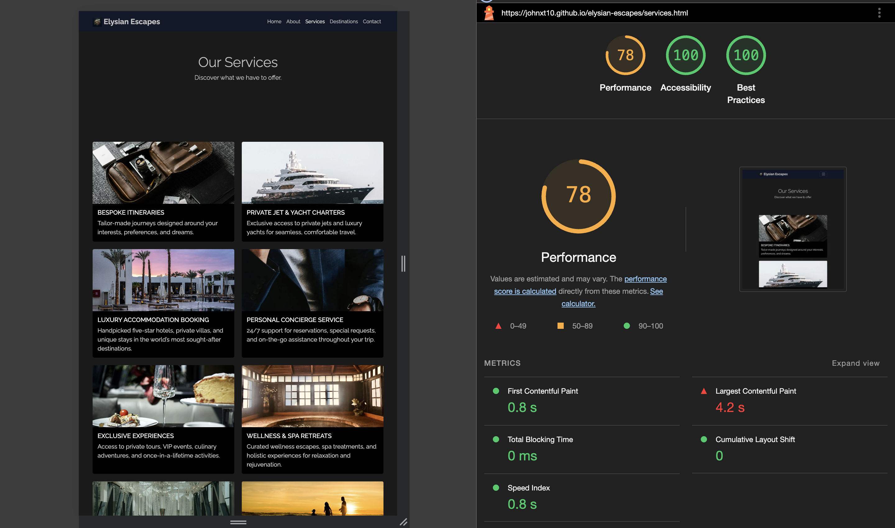  
*The Services page Lighthouse report highlights excellent performance and user experience.

Performance: Service cards load quickly, and the layout remains consistent across devices.
Accessibility: Clickable cards are keyboard-accessible, and all service images include descriptive alt attributes.
Best Practices: The codebase avoids deprecated features and ensures smooth navigation, supporting a premium brand feel.*

### Contact
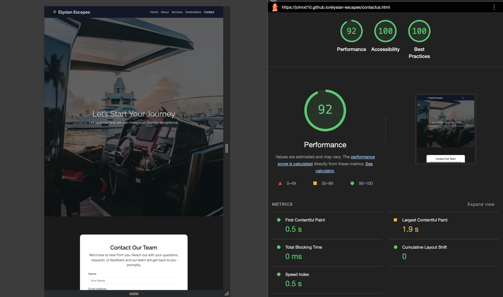  
*The Contact page Lighthouse report shows high scores in all categories.

Performance: The contact form and supporting assets load instantly, with minimal delay.
Accessibility: Form fields are properly labeled, ensuring users with assistive devices can interact easily.
Best Practices: Input validation and secure form handling are implemented, maintaining user trust and data integrity.*

### Diagnostics
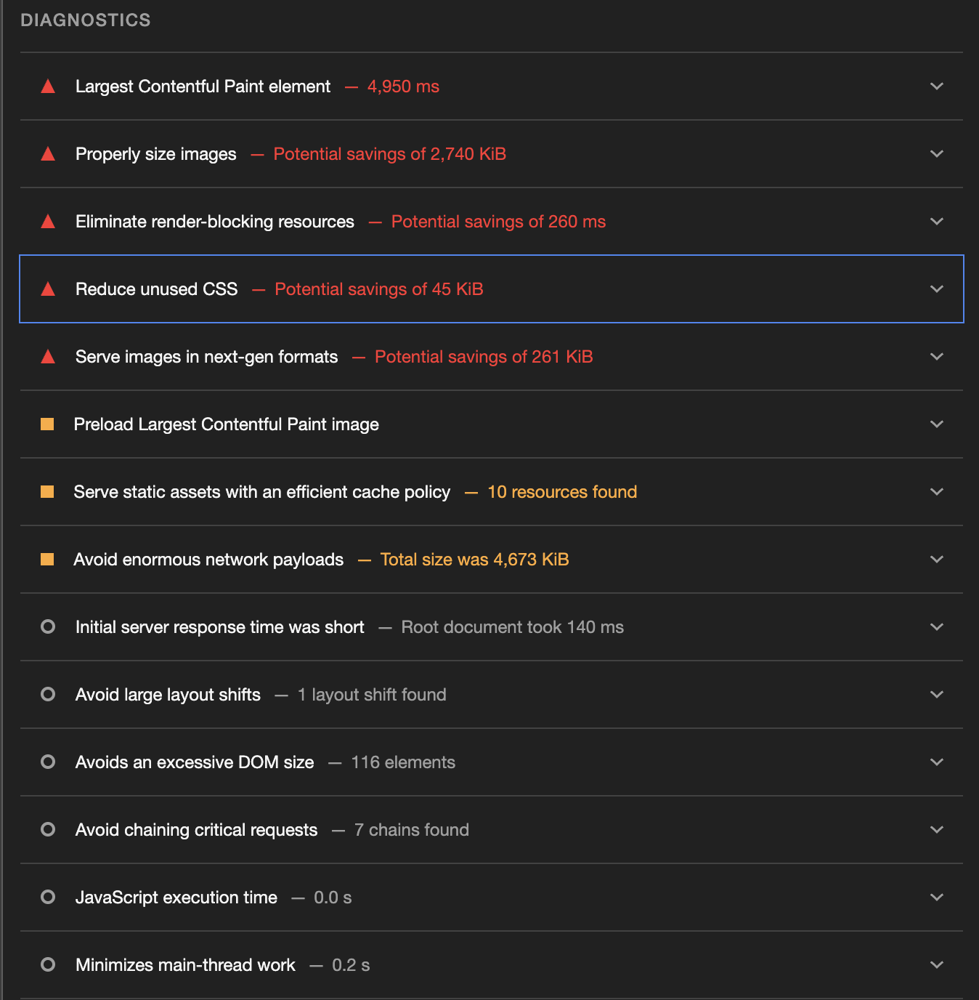  
*The Diagnostics section of the Lighthouse report indicates that there are no further actionable improvements for performance at this time. All major recommendations have been addressed. Each image on the site has been carefully compressed to reduce file size while maintaining high resolution and visual quality, ensuring both fast load times and a premium user experience.*

---

## Updates

### General 

- Add detailed comments across all pages explaining each major block 
- Moved comments above the code block and explainedwhat each section does in CSS
- Removed hover effects from contact form
- Removed capital letters from file names
- Added a small overlay on the hero text to make it more visible on Home,
- Ensured all interative elements have sufficient contrast for readability. 
- Adjusted padding and margins in the welcome section

### **README.md**

- 📝 Added table of contents at the top of the file. [Table of contents](#table-of-contents)
- 📸 Added screenshot of the hompage after the introduction. [Screenshot](#elysian-escapes)
- Responsive design for different devices. [Wireframes](#wireframes)
- 🚀 Deployment link already added. [Live Website](#live-website)
- ✅ Created a seperate testing file inside screenshots

[Back to Top](#table-of-contents)